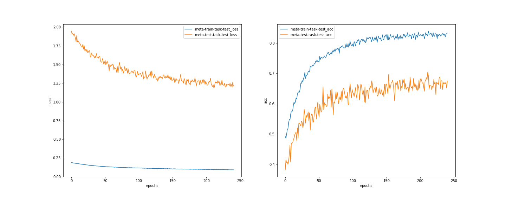

# maml-pytorch

- MAML omniglot implementation.
- Please also see https://github.com/naruya/maml-pytorch/blob/train/notebooks/maml.ipynb .

- original MAML implementation
    - https://github.com/cbfinn/maml
    - https://github.com/katerakelly/pytorch-maml
    
## Dependencies
- python3
- PyTorch 0.4.1

tested on Ubuntu 18.04

## Result

10-way 1-shot training, best performance 85.8%

